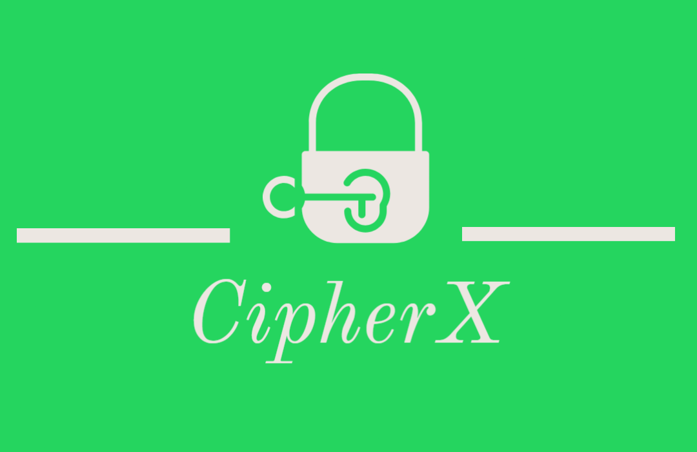
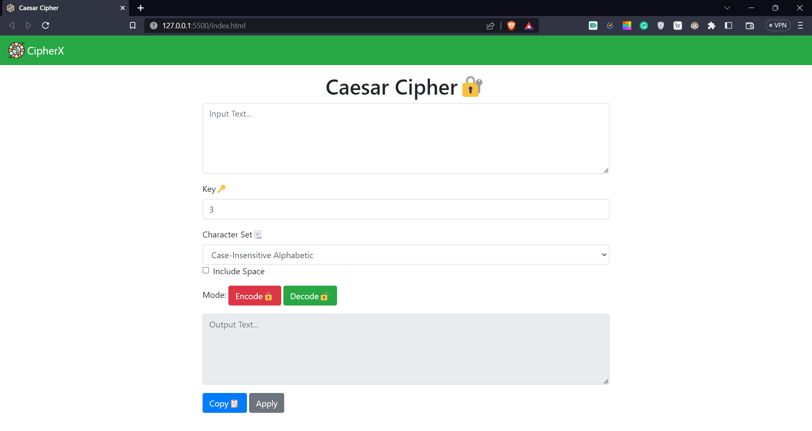
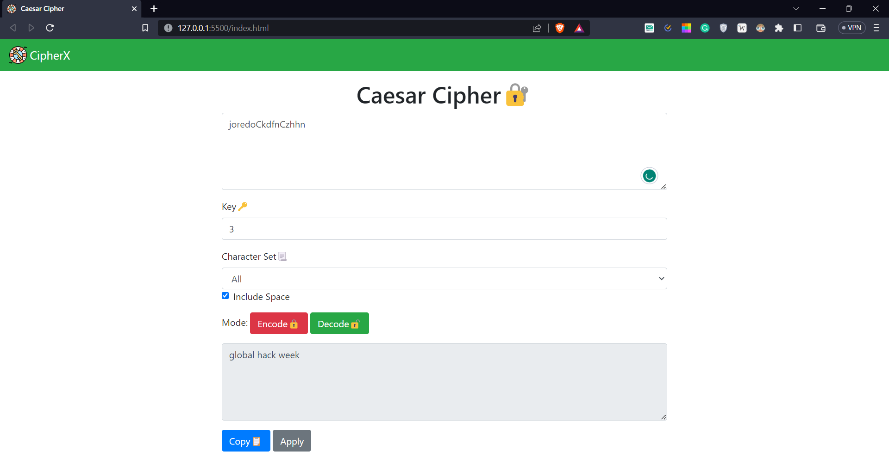

# CipherX - Securing Secrets with the Power of Caesar's Cipher
> CipherX is a web-based application that enables users to encrypt and decrypt messages using the Caesar Cipher algorithm. It provides a user-friendly interface where users can input their messages, choose a shift value, and instantly see the encrypted or decrypted result.
> Live demo [_here_](https://aman-chhetri.github.io/cipher-x/). <!-- Project Link -->

## Table of Contents
* [Inspiration 💡](#inspiration)
* [What it does ⚙️](#what_it_does)
* [How I built it 🛠️](#built)
* [Challenges I ran into 😓](#challenges)
* [Accomplishments that I am proud of 🏅](#accomplishments)
* [What I learned 🎓](#learning)
* [What's next for CipherX 🔜](#what-next)
* [Screenshots 🖼️](#screenshots)
* [Contact 📩](#contact)

## Inspiration💡
The inspiration behind CipherX came from a fascination with cryptography and the timeless Caesar Cipher encryption technique. I wanted to create a simple yet powerful tool that allows users to encrypt and decrypt messages using this ancient encryption method.

## What it does⚙️
CipherX is a web-based application that enables users to encrypt and decrypt messages using the Caesar Cipher algorithm. It provides a user-friendly interface where users can input their messages, choose a shift value, and instantly see the encrypted or decrypted result. The application supports uppercase and lowercase letters, numbers, and common symbols.

## How we built it 🛠️
- I built CipherX using HTML, CSS, and JavaScript. HTML provided the structure of the application, CSS handled the visual styling, and JavaScript implemented the encryption and decryption logic. 
- I leveraged JavaScript's string manipulation functions to shift the characters based on the chosen shift value and update the result in real time.

## Challenges I ran into😓
One of the main challenges I faced was handling special characters and maintaining the original formatting of the message. I had to carefully consider how to preserve spaces, punctuation marks, and line breaks during the encryption and decryption processes. Additionally, ensuring the application's responsiveness and compatibility across different devices and browsers presented its own set of challenges.

## Accomplishments that I am proud of🏅
I am proud to have created a fully functional Caesar Cipher encryption and decryption program within the given timeframe. The application provides a smooth and intuitive user experience, making it easy for anyone to secure their messages using this classic encryption technique. I am also proud of the attention to detail in preserving the original message formatting, allowing for seamless communication.

## What I learned🎓
During the development of CipherX, I deepened my understanding of JavaScript string manipulation, including how to iterate through characters, apply transformations, and handle special cases. I also gained valuable experience in building responsive web applications that adapt to different screen sizes and browsers. Additionally, working as a solo helps me to know the importance of time management and creative thinking to deliver a successful project.

## What's next for CipherX🔜
In the future, I am planning to enhance CipherX with additional encryption methods, such as substitution ciphers or more advanced cryptographic algorithms. I also aim to add features like key generation and password protection to further enhance the security of the encrypted messages. Additionally, I will focus on optimizing the application's performance and expanding its compatibility to reach a wider audience.

## Screenshots 🖼️

## Contact 📩
Created by: [@amankshetri](https://www.linkedin.com/in/amankshetri/) - feel free to contact me! 🙂
